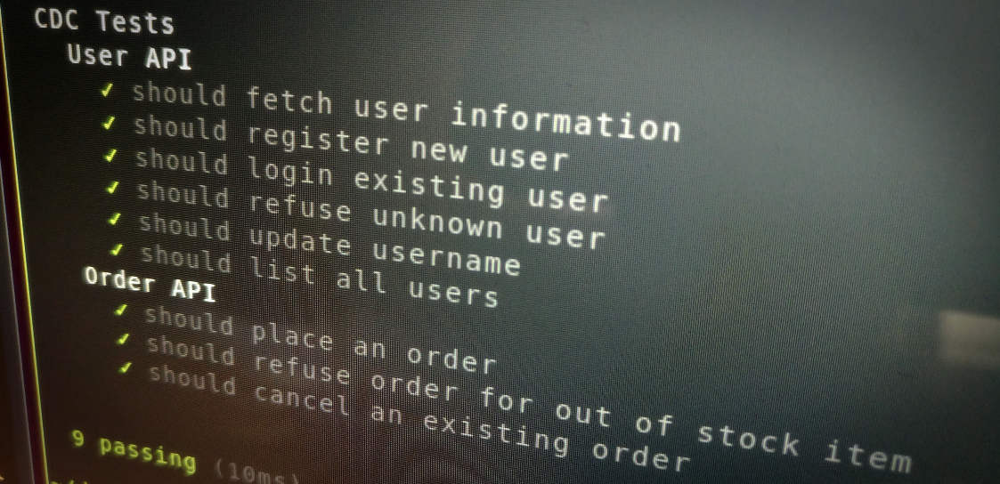

# Effective Software Testing

Production-ready software requires testing before it goes into production. As the discipline of software development matured, software testing approaches have matured too. Instead of having myriads of manual software testers development teams have moved towards automating the biggest portion of their testing efforts. Automating your test efforts allows teams to know whether their software is broken in a matter of seconds and minutes instead of days and weeks.

The drastically shortened feedback loop fueled by automated tests goes hand in hand with agile development practices, continuous delivery and DevOps culture. Having an effective software testing approach allows your team to move fast and confidently.

This article explores how a well-rounded test portfolio should look like to be responsive, reliable and maintainable - regardless of whether you're building a microservices architecture, mobile apps or IoT ecosystems. We'll also get into the details of building effective and readable automated tests.
