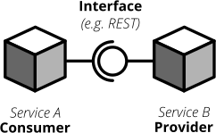
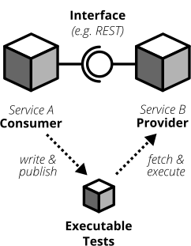

# Contract Tests
More modern software development organisations have found ways of scaling their development efforts by spreading the development of a system across different teams. Individual teams build individual, loosely coupled services without stepping on each others toes and integrate these services into a big, cohesive system. The more recent buzz around microservices focuses on exactly that.

Splitting your system into many small services often means that these services need to communicate with each other via certain (hopefully well-defined, sometimes accidentally grown) interfaces.

Interfaces between different applications can come in different shapes and technologies. Common ones are

  * REST and JSON via HTTPS
  * <abbr title="remote procedure calls">RPC</abbr> using something like [gRPC](https://grpc.io/)
  * building an event-driven architecture using queues

For each interface there are two parties involved: the **provider** and the **consumer**. The provider serves data to consumers. The consumer processes data obtained from a provider. In a REST world a provider builds a REST API with all required endpoints; a consumer makes calls to this REST API to fetch data or trigger changes in the other service. In an asynchronous, event-driven world, a provider (often rather called **publisher**) publishes data to a queue; a consumer (often called **subscriber**) subscribes to these queues and reads and processes data.

_Each interface has a providing (or publishing) and a consuming (or subscribing) party. The specification of an interface can be considered a contract._

As you often spread the consuming and providing services across different teams you find yourself in the situation where you have to clearly specify the interface between these services (the so called **contract**). Traditionally companies have approached this problem in the following way:

  1. Write a long and detailed interface specification (the _contract_)
  2. Implement the providing service according to the defined contract
  3. Throw the interface specification over the fence to the consuming team
  4. Wait until they implement their part of consuming the interface
  5. Run some large-scale manual system test to see if everything works
  6. Hope that both teams stick to the interface definition forever and don't screw up

If you're not stuck in the dark ages of software development, you hopefully have replaced steps _5._ and _6._ with something more automated. Automated contract tests make sure that the implementations on the consumer and provider side still stick to the defined contract. They serve as a good regression test suite and make sure that deviations from the contract will be noticed early.

In a more agile organisation you should take the more efficient and less wasteful route. You build your applications within the same organisation. It really shouldn't be too hard to talk to the developers of the other services directly instead of throwing overly detailed documentation over the fence. After all they're your co-workers and not a third-party vendor that you could only talk to via customer support or legally bulletproof contracts.

**Consumer-Driven Contract tests** (**CDC tests**) let the consumers drive the implementation of a contract. Using CDC, consumers of an interface write tests that check the interface for all data they need from that interface. The consuming team then publishes these tests so that the publishing team can fetch and execute these tests easily. The providing team can now develop their API by running the CDC tests. Once all tests pass they know they have implemented everything the consuming team needs.

_Contract tests ensure that the provider and all consumers of an interface stick to the defined interface contract. With CDC tests consumers of an interface publish their requirements in the form of automated tests; the providers fetch and execute these tests continuously_

This approach allows the providing team to implement only what's really necessary (keeping things simple, <abbr title="You ain't gonna need it">YAGNI</abbr> and all that). The team providing the interface should fetch and run these CDC tests continuously (in their build pipeline) to spot any breaking changes immediately. If they break the interface their CDC tests will fail, preventing breaking changes to go live. As long as the tests stay green the team can make any changes they like without having to worry about other teams.
The Consumer-Driven Contract approach would leave you with a process looking like this:

  1. The consuming team writes automated tests with all consumer expectations
  3. They publish the tests for the providing team
  4. The providing team runs the CDC tests continuously and keeps them green
  5. Both teams talk to each other once the CDC tests break

If your organisation adopts a microservices approach, having CDC tests is a big step towards establishing autonomous teams. CDC tests are an automated way to foster team communication. They ensure that interfaces between teams are working at any time. Failing CDC tests are a good indicator that you should walk over to the affected team, have a chat about any upcoming API changes and figure out how you want to move forward.

A naive implementation of CDC tests can be as simple as firing requests against an API and assert that the responses contain everything you need. You then package these tests as an executable (.gem, .jar, .sh) and upload it somewhere the other team can fetch it (e.g. an artifact repository like [Artifactory](https://www.jfrog.com/artifactory/)).

Over the last couple of years the CDC approach has become more and more popular and several tools been build to make writing and exchanging them easier.

[Pact](https://github.com/realestate-com-au/pact) is probably the most prominent one these days. It has a sophisticated approach of writing tests for the consumer and the provider side, gives you stubs for third-party services out of the box and allows you to exchange CDC tests with other teams. Pact has been ported to a lot of platforms and can be used with JVM languages, Ruby, .NET, JavaScript and many more.

If you want to get started with CDCs and don't know how, Pact can be a sane choice. The [documentation](https://docs.pact.io/) can be overwhelming at first. Be patient and work through it. It helps to get a firm understanding for CDCs which in turn makes it easier for you to advocate for the use of CDCs when working with other teams.

Consumer-Driven Contract tests can be a real game changer to establish autonomous teams that can move fast and with confidence. Do yourself a favor, read up on that concept and give it a try. A solid suite of CDC tests is invaluable for being able to move fast without breaking other services and cause a lot of frustration with other teams.
