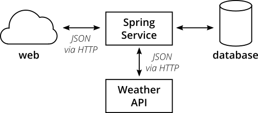
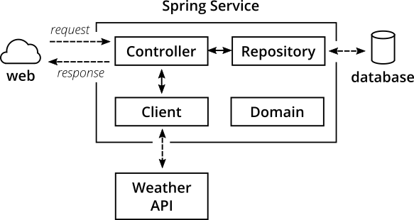

# The Sample Application [Java]
I've written a [simple microservice](https://github.com/hamvocke/spring-testing) including a test suite with tests for the different layers of the test pyramid. There are more tests than necessary for an application of this size. The tests on different levels overlap. This actively contradicts the advice that you should avoid test duplication throughout your test pyramid. Here I decided to go for duplication for demonstration purposes. Please keep in mind that this is not what you want for your real-world application. Duplicated tests are smelly and will be more annoying than helpful in the long term.

The sample application shows traits of a typical microservice. It provides a REST interface, talks to a database and fetches information from a third-party REST service. It's implemented in [Spring Boot ](https://projects.spring.io/spring-boot/) and should be understandable even if you've never worked with Spring Boot before.

Make sure to check out [the code on GithHub](https://github.com/hamvocke/spring-testing). The readme contains instructions you need to run the application and its automated tests on your machine.

## Functionality
The application's functionality is simple. It provides a REST interface with three endpoints:

1. `GET /hello`: Returns _"Hello World"_. Always.
2. `GET /hello/{lastname}`: Looks up the person with the provided last name. If the person is known, returns _"Hello {Firstname} {Lastname}"_.
3. `GET /weather`: Returns the current weather conditions for _Hamburg, Germany_.

## High-level Structure
On a high-level the system has the following structure:

_the high level structure of our microservice system_

Our microservice provides a REST interface that can be called via HTTP. For some endpoints the service will fetch information from a database. In other cases the service will call an external [weather API](https://darksky.net) via HTTP to fetch and display current weather conditions.

## Internal Architecture
Internally, the Spring Service has a Spring-typical architecture:

_the internal structure of our microservice_

* `Controller` classes provide _REST_ endpoints and deal with _HTTP_ requests and responses
* `Repository` classes interface with the _database_ and take care of writing and reading data to/from persistent storage
* `Client` classes talk to other APIs, in our case it fetches _JSON_ via _HTTPS_ from the darksky.net weather API
* `Domain` classes capture our [domain model](https://en.wikipedia.org/wiki/Domain_model) including the domain logic (which, to be fair, is quite trivial in our case).

Experienced Spring developers might notice that a frequently used layer is missing here: Inspired by [Domain-Driven Design](https://en.wikipedia.org/wiki/Domain-driven_design) a lot of developers build a **service layer** consisting of _service_ classes. I decided not to include a service layer in this application. One reason is that our application is simple enough, a service layer would have been an unnecessary level of indirection. The other one is that I think people overdo it with service layers. I often encounter codebases where the entire business logic is captured within service classes. The domain model becomes merely a layer for data, not for behaviour (Martin Fowler calls this an [Aenemic Domain Model](https://en.wikipedia.org/wiki/Anemic_domain_model)). For every non-trivial application this wastes a lot of potential to keep your code well-structured and testable and does not fully utilize the power of object orientation.

Our repositories are straightforward and provide simple <abbr title="Create Read Update Delete">CRUD</abbr> functionality. To keep the code simple I used [Spring Data](http://projects.spring.io/spring-data/). Spring Data gives us a simple and generic CRUD repository implementation that we can use instead of rolling our own. It also takes care of spinning up an in-memory database for our tests instead of using a real PostgreSQL database as it would in production.

Take a look at the codebase and make yourself familiar with the internal structure. It will be useful for our next step: Testing the application!
